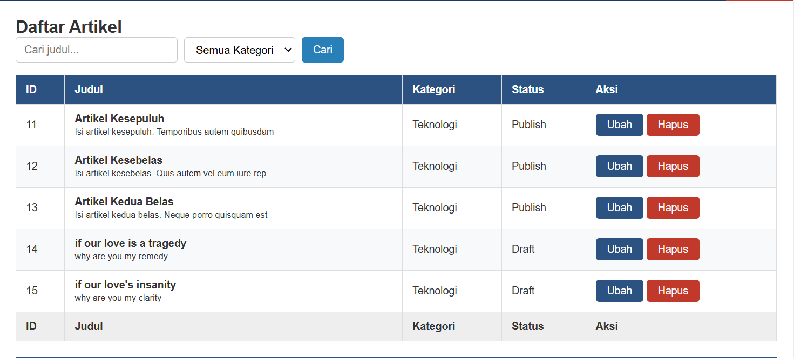
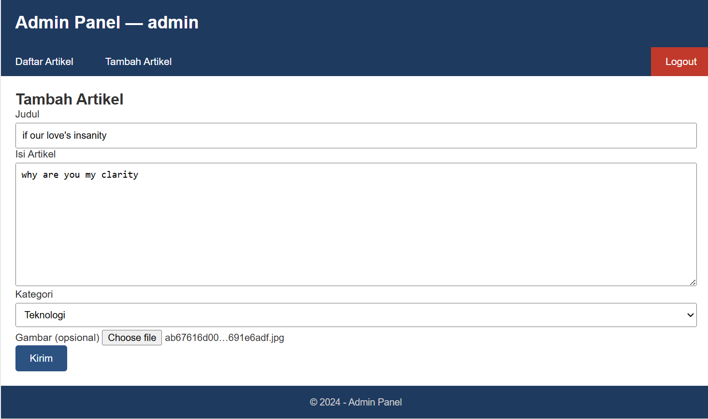

# 📚 Praktikum 6 - Relasi Tabel dan Query Builder

## 📌 Deskripsi

Praktikum ini bertujuan untuk mempelajari implementasi relasi antar tabel pada database menggunakan CodeIgniter 4. Pada praktikum ini dibuat relasi **One-to-Many** antara tabel `kategori` dan `artikel`, di mana satu kategori dapat memiliki banyak artikel.

Selain itu, praktikum juga membahas penggunaan **Query Builder** untuk melakukan operasi JOIN tabel, pencarian data berdasarkan kata kunci, filtering berdasarkan kategori, serta menampilkan data hasil relasi ke dalam halaman web.

---

## 🎯 Tujuan Praktikum

- Memahami konsep relasi antar tabel dalam database.
- Mengimplementasikan relasi One-to-Many.
- Menggunakan Query Builder untuk melakukan JOIN tabel.
- Menampilkan data dari tabel yang saling berelasi.
- Menerapkan fitur pencarian dan filter data.

---

## 🛠️ Fitur yang Diimplementasikan

### 1. Membuat Tabel Kategori
Membuat tabel `kategori` yang digunakan untuk mengelompokkan artikel berdasarkan jenis atau topik tertentu.

### 2. Menambahkan Foreign Key
Menambahkan kolom `id_kategori` pada tabel `artikel` sebagai foreign key yang menghubungkan tabel artikel dengan tabel kategori.

### 3. Membuat Model Kategori
Membuat `KategoriModel.php` untuk melakukan operasi CRUD pada tabel kategori.

### 4. Relasi dan JOIN Tabel
Menambahkan method `getArtikelDenganKategori()` pada `ArtikelModel` untuk mengambil data artikel beserta nama kategorinya menggunakan Query Builder dan JOIN.

### 5. Filter dan Pencarian Artikel
Menambahkan fitur:
- Pencarian artikel berdasarkan judul.
- Filter artikel berdasarkan kategori.
- Pagination untuk membatasi jumlah data yang ditampilkan.

### 6. Form Tambah dan Edit Artikel
Form tambah dan edit artikel diperbarui dengan dropdown kategori sehingga setiap artikel dapat dikaitkan dengan kategori tertentu.

---

## 📷 Screenshot

### Tampilan Daftar Artikel

---

### Form Tambah Artikel

---

## ✅ Hasil Praktikum

Praktikum berhasil diimplementasikan dengan baik. Sistem mampu menampilkan data artikel beserta kategori, melakukan pencarian dan filter data menggunakan Query Builder, serta mengelola data artikel melalui fitur tambah, ubah, dan hapus data.

---

## 👨‍💻 Teknologi yang Digunakan

- PHP 8
- CodeIgniter 4
- MySQL
- Bootstrap
- Visual Studio Code
